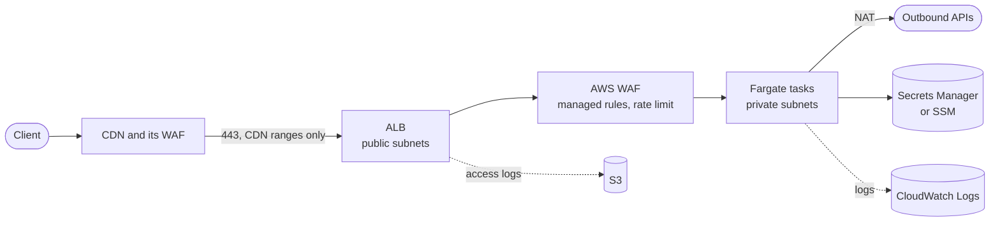

# terraform-aws-fargate-service

A container web service on AWS Fargate, behind an Application Load Balancer,
behind a CDN. Private subnets, a WAF, scoped IAM roles, access logs and
autoscaling.

The root module is the service. `modules/network` is a VPC you can use if you
do not already have one. Use either, or both.

## Request flow



The load balancer security group allows 443 from the CDN's ranges and nothing
else. That single decision is the difference between a CDN that protects you
and a CDN that can be walked around, so it is a required input with no default.

## What it creates

| Area | Resources |
|---|---|
| Load balancer | ALB, HTTPS listener on TLS 1.2 minimum, HTTP listener that redirects, target group, security group restricted to the CDN, access logs to S3 with a lifecycle |
| WAF | Regional web ACL with three AWS managed rule groups and a rate limit, associated to the ALB, logging to CloudWatch with the authorization and cookie headers redacted |
| Compute | ECS cluster with Container Insights, Fargate task definition, service with a deployment circuit breaker, CPU target tracking autoscaling |
| Networking | Task security group that accepts traffic from the load balancer only and egresses HTTPS plus DNS inside the VPC |
| Identity | Separate execution and task roles, both with confused deputy conditions, execution role scoped to exactly the secrets in the task definition |
| Images | ECR repository with scan on push, immutable tags, a lifecycle policy and a pull policy limited to this account |
| Logs | Container log group, WAF log group, and an execute-command log group when that is enabled |
| VPC (optional) | `modules/network`: two tier VPC, NAT, flow logs, emptied default security group, optional interface endpoints |

## What it deliberately does not do

- **No CDN, no DNS, no certificate.** Those usually sit with whoever owns the
  domain, often a different team or a different account. Take `alb_dns_name`
  from the outputs and point your origin at it.
- **No database.** Use `task_security_group_id` as the source in your database
  security group rather than a CIDR, so the rule follows the service.
- **No account baseline.** CloudTrail, GuardDuty, Config and account guardrails
  are in
  [terraform-aws-account-baseline](https://github.com/<your-org>/terraform-aws-account-baseline).
- **No secret values.** The module reads secrets you have already created. It
  does not create them, so they stay out of state.

## Usage

```hcl
module "network" {
  source = "github.com/<your-org>/terraform-aws-fargate-service//modules/network?ref=v0.1.0"

  name       = "my-service-prod"
  cidr_block = "10.0.0.0/16"
}

module "service" {
  source = "github.com/<your-org>/terraform-aws-fargate-service?ref=v0.1.0"

  name   = "my-service-prod"
  vpc_id = module.network.vpc_id

  public_subnet_ids  = module.network.public_subnet_ids
  private_subnet_ids = module.network.private_subnet_ids

  certificate_arn = aws_acm_certificate.this.arn
  container_image = "000000000000.dkr.ecr.eu-west-1.amazonaws.com/my-service@sha256:..."

  # Only the CDN reaches the origin.
  alb_ingress_cidrs = local.cdn_ranges

  # With a CDN in front, rate limit on the forwarded client address.
  waf_rate_limit_forwarded_ip_header = "X-Forwarded-For"
}
```

See [examples/complete](examples/complete) for a full configuration including
secrets and a task role.

## Locking the origin to your CDN

There are three ways to fill `alb_ingress_cidrs`, in descending order of how
much you should like them.

1. **A managed prefix list.** If the CDN is CloudFront, use
   `alb_ingress_prefix_list_ids = ["<id of com.amazonaws.global.cloudfront.origin-facing>"]`
   and leave `alb_ingress_cidrs` empty. AWS keeps the list current, so there is
   nothing to maintain and nothing to go stale.

2. **A scheduled job that refreshes the list.** Most CDNs publish their ranges
   at a stable URL. Fetch them on a schedule and update the security group, in
   a pipeline that runs whether or not anyone is deploying.

3. **A hardcoded list.** Simple, and it works until the CDN adds a range, at
   which point a fraction of your traffic starts failing in a way that looks
   like an application problem. If you do this, put a calendar reminder on it.

Fetching the ranges inside Terraform, with an `http` data source, is a fourth
option that reads well and behaves badly: every plan depends on an external
endpoint being up, and a change to the published list turns into an unrelated
diff in the middle of somebody else's deployment.

Whichever you choose, do not leave the origin open with the intention of
tightening it later. An origin that accepts traffic from anywhere means the
CDN's WAF, rate limiting and bot rules are advisory.

## Requirements

| Name | Version |
|---|---|
| Terraform | >= 1.5.0 (OpenTofu 1.6 or later also works) |
| AWS provider | >= 6.0.0, < 7.0.0 |

## Key inputs

| Name | Type | Default | Description |
|---|---|---|---|
| `name` | string | required | Prefix for every resource |
| `vpc_id` | string | required | |
| `public_subnet_ids` | list(string) | required | Load balancer. At least two AZs |
| `private_subnet_ids` | list(string) | required | Tasks. No route to an internet gateway |
| `certificate_arn` | string | required | ACM certificate for the listener |
| `container_image` | string | required | Pin a digest or an immutable tag |
| `alb_ingress_cidrs` | list(string) | `[]` | CDN ranges. Set this or the prefix list version |
| `alb_ingress_prefix_list_ids` | list(string) | `[]` | Managed prefix lists |
| `container_port` | number | `8080` | |
| `cpu` / `memory` | number | `512` / `1024` | Must be a valid Fargate pairing |
| `cpu_architecture` | string | `X86_64` | `ARM64` costs about 20 percent less if your image supports it |
| `secrets` | list(object) | `[]` | Injected at start up. The execution role is scoped to exactly these ARNs |
| `readonly_root_filesystem` | bool | `true` | Turn off only if the application writes to disk |
| `min_capacity` / `max_capacity` | number | `2` / `6` | `max_capacity` is also your cost ceiling |
| `enable_execute_command` | bool | `false` | A shell in production. Sessions are logged when on |
| `enable_waf` | bool | `true` | |
| `waf_rate_limit_forwarded_ip_header` | string | `null` | Set to `X-Forwarded-For` behind a CDN |
| `task_role_policy_json` | string | `null` | What your application code can do |
| `additional_egress_rules` | list(object) | `[]` | The default is HTTPS out and DNS in the VPC |

Every input is documented in [variables.tf](variables.tf).

## Outputs

`alb_dns_name`, `alb_zone_id`, `alb_arn`, `alb_security_group_id`,
`target_group_arn`, `cluster_name`, `service_name`, `task_security_group_id`,
`task_role_arn`, `task_role_name`, `execution_role_arn`, `ecr_repository_url`,
`log_group_name`, `access_logs_bucket`, `web_acl_arn`.

## Notes on choices

**Two IAM roles, and the difference matters.** The execution role is used by ECS
to pull the image, write logs and fetch the secrets named in the task
definition. The task role is used by your application code at runtime. Putting
application permissions on the execution role is a common mistake: it widens
what a compromised container can reach, because the container can use the task
role but should not be able to act as the platform.

**The execution role is scoped to the secrets you listed.** The module reads the
ARNs out of `secrets` and grants read on exactly those, splitting SSM from
Secrets Manager and trimming the JSON key suffix that Secrets Manager ARNs can
carry. There is no wildcard on `secretsmanager:GetSecretValue`.

**Rate limiting reads a header, not the source address.** Behind a CDN every
request arrives from the CDN's addresses. An IP based rate limit then counts
all of your traffic as one client and either never fires or blocks everyone. Set
`waf_rate_limit_forwarded_ip_header` and the WAF aggregates on the forwarded
address instead.

**Immutable ECR tags by default.** A mutable tag can be repointed at different
bytes after review, and a rollback to that tag may not get you what you rolled
back to. If your pipeline pushes a moving tag, change
`ecr_image_tag_mutability`, knowingly.

**Two principals on the access log bucket policy.** Regions opened before August
2022 deliver load balancer logs from a per region AWS account; newer ones use a
service principal. Both are granted, so the module works in either. The bucket
is SSE-S3 rather than KMS, because a bucket that silently rejects log writes is
worse than one encrypted with an AWS managed key.

**`desired_count` is ignored after creation.** Autoscaling owns the task count.
Without `ignore_changes`, every apply would reset the service to the value in
your configuration and undo whatever scaling had decided.

**Warnings rather than errors in two places.** The module warns, at plan time, if
`alb_ingress_cidrs` contains `0.0.0.0/0` or if `container_image` ends in
`:latest`. Both are sometimes deliberate in a test environment, so they do not
block. Read them.

## License

MIT. See [LICENSE](LICENSE).
