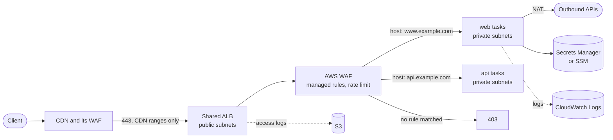

# terraform-aws-fargate-service

A container web service on AWS Fargate, behind an Application Load Balancer,
behind a CDN. Private subnets, a WAF, scoped IAM roles, access logs and
autoscaling.

Three modules. `modules/alb` is one load balancer, certificate, WAF and access
log bucket. The root module is a service that attaches to it, routed by
hostname. `modules/network` is a VPC you can use if you do not already have one.

**One load balancer serves many services.** Stand up `modules/alb` once, then
call the root module for each service with its own hostnames. A fourth service
is another module block, not another load balancer. At five services that is
roughly $170 a month less than one load balancer and WAF each.

## Request flow


```mermaid
flowchart LR
  U([Client]) --> C[CDN and its WAF]
  C -->|443, CDN ranges only| A[Shared ALB<br/>public subnets]
  A --> W[AWS WAF<br/>managed rules, rate limit]
  W -->|host: www.example.com| T1[web tasks<br/>private subnets]
  W -->|host: api.example.com| T2[api tasks<br/>private subnets]
  W -->|no rule matched| X[403]
  T1 -->|NAT| I([Outbound APIs])
  T1 --> S[(Secrets Manager<br/>or SSM)]
  A -.access logs.-> B[(S3)]
  T1 -.logs.-> L[(CloudWatch Logs)]
```

The load balancer security group allows 443 from the CDN's ranges and nothing
else. That single decision is the difference between a CDN that protects you
and a CDN that can be walked around, so it is a required input with no default.

## What it creates

`modules/alb`, once per load balancer:

| Area | Resources |
|---|---|
| Load balancer | ALB, HTTPS listener on TLS 1.2 minimum with a default action that refuses, HTTP listener that redirects, security group restricted to the CDN, access logs to S3 with a lifecycle |
| WAF | Regional web ACL with three AWS managed rule groups and a rate limit, associated to the ALB, logging to CloudWatch with the authorization and cookie headers redacted |

The root module, once per service:

| Area | Resources |
|---|---|
| Routing | Target group, a listener rule claiming this service's hostnames, and one egress rule on the shared security group to this service's tasks |
| Origin lock | Optional secret header added as a second condition on that rule, so only your CDN distribution reaches the origin, not every customer of that CDN |
| Alarms | 5xx rate, unhealthy targets, running tasks below the floor. The first two also drive deployment rollback |
| Compute | ECS cluster with Container Insights, Fargate task definition, service with a deployment circuit breaker, CPU target tracking autoscaling |
| Networking | Task security group that accepts traffic from the load balancer only and egresses HTTPS plus DNS inside the VPC |
| Identity | Separate execution and task roles, both with confused deputy conditions, execution role scoped to exactly the secrets in the task definition |
| Images | ECR repository with scan on push, immutable tags, a lifecycle policy and a pull policy limited to this account |
| Logs | Container log group, WAF log group, and an execute-command log group when that is enabled |
| VPC (optional) | `modules/network`: two tier VPC, NAT, flow logs, emptied default security group, optional interface endpoints |

## What it deliberately does not do

- **No CDN, no DNS, no certificate.** Those usually sit with whoever owns the
  domain, often a different team or a different account. Take `dns_name` from
  the alb module's outputs and point your origin at it.
- **No database.** Use `task_security_group_id` as the source in your database
  security group rather than a CIDR, so the rule follows the service.
- **No account baseline.** CloudTrail, GuardDuty, Config and account guardrails
  are in
  [terraform-aws-account-baseline](https://github.com/<your-org>/terraform-aws-account-baseline).
- **No secret values.** The module reads secrets you have already created. It
  does not create them, so they stay out of state.

## Usage

```hcl
module "network" {
  source = "github.com/<your-org>/terraform-aws-fargate-service//modules/network?ref=v0.2.0"

  name       = "platform-prod"
  cidr_block = "10.0.0.0/16"
}

# Once. Every service below shares it.
module "alb" {
  source = "github.com/<your-org>/terraform-aws-fargate-service//modules/alb?ref=v0.2.0"

  name       = "platform-prod"
  vpc_id     = module.network.vpc_id
  subnet_ids = module.network.public_subnet_ids

  certificate_arn = aws_acm_certificate.this.arn

  # Only the CDN reaches the origin.
  ingress_cidrs = local.cdn_ranges

  # With a CDN in front, rate limit on the forwarded client address.
  waf_rate_limit_forwarded_ip_header = "X-Forwarded-For"
}

module "web" {
  source = "github.com/<your-org>/terraform-aws-fargate-service?ref=v0.2.0"

  name   = "web-prod"
  vpc_id = module.network.vpc_id

  private_subnet_ids = module.network.private_subnet_ids

  listener_arn          = module.alb.listener_arn
  alb_security_group_id = module.alb.security_group_id
  alb_arn_suffix        = module.alb.arn_suffix

  host_headers           = ["www.example.com", "example.com"]
  listener_rule_priority = 100

  container_image = "000000000000.dkr.ecr.eu-west-1.amazonaws.com/web@sha256:..."
}

# A second service. Different hostname, different priority, same load balancer.
module "api" {
  source = "github.com/<your-org>/terraform-aws-fargate-service?ref=v0.2.0"

  name   = "api-prod"
  vpc_id = module.network.vpc_id

  private_subnet_ids = module.network.private_subnet_ids

  listener_arn          = module.alb.listener_arn
  alb_security_group_id = module.alb.security_group_id
  alb_arn_suffix        = module.alb.arn_suffix

  host_headers           = ["api.example.com"]
  listener_rule_priority = 200

  container_image = "000000000000.dkr.ecr.eu-west-1.amazonaws.com/api@sha256:..."
}
```

Priorities are evaluated low to high and must be unique on the listener. Leave
gaps so a service can be inserted later without renumbering the others, which
would otherwise destroy and recreate rules on a live listener.

A request whose hostname matches no rule gets the listener's default action, a
403. A hostname pointed at the load balancer before its service exists is
refused rather than handed to whichever service happens to be first.

See [examples/complete](examples/complete) for a full configuration including
secrets and a task role.

## Locking the origin to your CDN

There are three ways to fill `ingress_cidrs` on the alb module, in descending
order of how much you should like them.

1. **A managed prefix list.** If the CDN is CloudFront, use
   `ingress_prefix_list_ids = ["<id of com.amazonaws.global.cloudfront.origin-facing>"]`
   and leave `ingress_cidrs` empty. AWS keeps the list current, so there is
   nothing to maintain and nothing to go stale.

2. **A scheduled job that refreshes the list.** Most CDNs publish their ranges
   at a stable URL. Fetch them on a schedule and update the security group, in
   a pipeline that runs whether or not anyone is deploying.

3. **A hardcoded list.** Simple, and it works until the CDN adds a range, at
   which point a fraction of your traffic starts failing in a way that looks
   like an application problem. If you do this, put a calendar reminder on it.

Fetching the ranges inside Terraform, with an `http` data source, is a fourth
option that reads well and behaves badly: every plan depends on an external
endpoint being up, and a change to the published list turns into an unrelated
diff in the middle of somebody else's deployment.

Whichever you choose, do not leave the origin open with the intention of
tightening it later. An origin that accepts traffic from anywhere means the
CDN's WAF, rate limiting and bot rules are advisory.

**Ranges alone are not enough.** An IP allowlist proves a request came from the
CDN. It does not prove it came from *your* account with that CDN. Every
CloudFront distribution shares the same ranges, and Cloudflare is the same
story, so anyone can point their own distribution at your origin and walk
straight through the allowlist.

Set `origin_secret_header` to close that. The CDN adds the header, and the
listener returns 403 to anything without it:

```hcl
origin_secret_header = {
  name  = "x-origin-token"
  value = data.aws_secretsmanager_secret_version.origin.secret_string
}
```

It is a listener rule rather than a WAF rule, so it still applies when
`enable_waf` is false, and it costs nothing. The value does land in Terraform
state, so generate it outside Terraform and read it from your secret store.

## Requirements

| Name | Version |
|---|---|
| Terraform | >= 1.5.0 (OpenTofu 1.6 or later also works) |
| AWS provider | >= 6.0.0, < 7.0.0 |

## Key inputs

### `modules/alb`

| Name | Type | Default | Description |
|---|---|---|---|
| `name` | string | required | Prefix for the load balancer and everything attached |
| `vpc_id` | string | required | |
| `subnet_ids` | list(string) | required | At least two AZs |
| `certificate_arn` | string | required | ACM certificate for the listener |
| `ingress_cidrs` | list(string) | `[]` | CDN ranges. Set this or the prefix list version |
| `ingress_prefix_list_ids` | list(string) | `[]` | Managed prefix lists |
| `additional_certificate_arns` | list(string) | `[]` | Extra certificates for other hostnames |
| `internal` | bool | `false` | |
| `enable_waf` | bool | `true` | One WAF covers every service on the load balancer |
| `waf_rate_limit_forwarded_ip_header` | string | `null` | Set to `X-Forwarded-For` behind a CDN |
| `unmatched_request_status_code` | string | `"403"` | Returned when no service rule matches |
| `access_logs_retention_days` | number | `90` | |

### Root module, per service

| Name | Type | Default | Description |
|---|---|---|---|
| `name` | string | required | Prefix for every resource |
| `vpc_id` | string | required | |
| `private_subnet_ids` | list(string) | required | Tasks. No route to an internet gateway |
| `listener_arn` | string | required | From `module.alb.listener_arn` |
| `alb_security_group_id` | string | required | From `module.alb.security_group_id` |
| `alb_arn_suffix` | string | required | From `module.alb.arn_suffix`, for the alarm dimensions |
| `host_headers` | list(string) | required | Hostnames this service answers on |
| `listener_rule_priority` | number | required | Unique on the listener. Leave gaps |
| `container_image` | string | required | Pin a digest or an immutable tag |
| `container_port` | number | `8080` | |
| `cpu` / `memory` | number | `512` / `1024` | Must be a valid Fargate pairing |
| `cpu_architecture` | string | `X86_64` | `ARM64` costs about 20 percent less if your image supports it |
| `secrets` | list(object) | `[]` | Injected at start up. The execution role is scoped to exactly these ARNs |
| `readonly_root_filesystem` | bool | `true` | Turn off only if the application writes to disk |
| `min_capacity` / `max_capacity` | number | `2` / `6` | `max_capacity` is also your cost ceiling |
| `enable_execute_command` | bool | `false` | A shell in production. Sessions are logged when on |
| `origin_secret_header` | object | `null` | `{name, value}`. Added as a second condition on the rule |
| `enable_alarms` | bool | `true` | Service health alarms |
| `alarm_topic_arns` | list(string) | `[]` | Pass the topic from the account baseline |
| `rollback_on_alarm` | bool | `true` | Roll back a deployment when the load balancer alarms fire |
| `task_role_policy_json` | string | `null` | What your application code can do |
| `additional_egress_rules` | list(object) | `[]` | The default is HTTPS out and DNS in the VPC |

Every input is documented in [variables.tf](variables.tf) and
[modules/alb/variables.tf](modules/alb/variables.tf).

## Outputs

`modules/alb`: `arn`, `dns_name`, `zone_id`, `listener_arn`, `arn_suffix`,
`security_group_id`, `access_logs_bucket`, `web_acl_arn`.

Root module: `target_group_arn`, `listener_rule_arn`, `cluster_name`,
`service_name`, `task_security_group_id`, `task_role_arn`, `task_role_name`,
`execution_role_arn`, `ecr_repository_url`, `log_group_name`.

## Upgrading from v0.1.0

In v0.1.0 every service created its own load balancer, WAF and access log
bucket. From v0.2.0 those live in `modules/alb` and services share one.

For a single service this is a rename, not a rebuild, if you move the state:

```
terraform state mv 'module.service.aws_lb.this' 'module.alb.aws_lb.this'
terraform state mv 'module.service.aws_security_group.alb' 'module.alb.aws_security_group.this'
terraform state mv 'module.service.aws_lb_listener.https' 'module.alb.aws_lb_listener.https'
terraform state mv 'module.service.aws_lb_listener.http' 'module.alb.aws_lb_listener.http'
terraform state mv 'module.service.aws_s3_bucket.access_logs' 'module.alb.aws_s3_bucket.access_logs'
terraform state mv 'module.service.aws_wafv2_web_acl.this[0]' 'module.alb.aws_wafv2_web_acl.this[0]'
```

Then set the new required inputs on the service: `listener_arn`,
`alb_security_group_id`, `alb_arn_suffix`, `host_headers` and
`listener_rule_priority`. These inputs moved to `modules/alb` and are no longer
accepted by the root module: `public_subnet_ids`, `certificate_arn`,
`additional_certificate_arns`, `ssl_policy`, `internal`, `idle_timeout`,
`enable_deletion_protection`, `access_logs_retention_days`, `alb_ingress_cidrs`,
`alb_ingress_prefix_list_ids`, `enable_waf`, `waf_rate_limit`,
`waf_managed_rule_groups`, `waf_rate_limit_forwarded_ip_header`.

**Read the plan before applying.** If the state moves are wrong the plan
destroys a live load balancer.

One behaviour change worth knowing: the HTTPS listener's default action is now
always a fixed 403. In v0.1.0 it forwarded to the service unless an origin
secret was set. Traffic now reaches a service only if its host header matches a
rule, so `host_headers` has to cover every hostname the service is meant to
answer on.

## Notes on choices

**Two IAM roles, and the difference matters.** The execution role is used by ECS
to pull the image, write logs and fetch the secrets named in the task
definition. The task role is used by your application code at runtime. Putting
application permissions on the execution role is a common mistake: it widens
what a compromised container can reach, because the container can use the task
role but should not be able to act as the platform.

**The execution role is scoped to the secrets you listed.** The module reads the
ARNs out of `secrets` and grants read on exactly those, splitting SSM from
Secrets Manager and trimming the JSON key suffix that Secrets Manager ARNs can
carry. There is no wildcard on `secretsmanager:GetSecretValue`.

**Rate limiting reads a header, not the source address.** Behind a CDN every
request arrives from the CDN's addresses. An IP based rate limit then counts
all of your traffic as one client and either never fires or blocks everyone. Set
`waf_rate_limit_forwarded_ip_header` and the WAF aggregates on the forwarded
address instead.

**Immutable ECR tags by default.** A mutable tag can be repointed at different
bytes after review, and a rollback to that tag may not get you what you rolled
back to. If your pipeline pushes a moving tag, change
`ecr_image_tag_mutability`, knowingly.

**Two principals on the access log bucket policy.** Regions opened before August
2022 deliver load balancer logs from a per region AWS account; newer ones use a
service principal. Both are granted, so the module works in either. The bucket
is SSE-S3 rather than KMS, because a bucket that silently rejects log writes is
worse than one encrypted with an AWS managed key.

**`desired_count` is ignored after creation.** Autoscaling owns the task count.
Without `ignore_changes`, every apply would reset the service to the value in
your configuration and undo whatever scaling had decided.

**Deployment rollback watches metrics, not just process exits.** The circuit
breaker catches tasks that fail to start. It does not catch a release that
starts cleanly and then serves 500s. The 5xx rate and unhealthy target alarms
are wired into the service's deployment alarms so that case rolls back too. The
running task count alarm is deliberately left out, because an alarm scoped to
the service cannot be a dependency of the service.

**WAF is on by default.** This module cannot know whether a CDN with its own WAF
sits in front of it, so it assumes not. If you have one, `enable_waf = false` is
a reasonable saving of about 9 dollars a month, but only once the origin lock
above is in place.

**Warnings rather than errors in two places.** The module warns, at plan time, if
`ingress_cidrs` contains `0.0.0.0/0` or if `container_image` ends in
`:latest`. Both are sometimes deliberate in a test environment, so they do not
block. Read them.

## License

MIT. See [LICENSE](LICENSE).
